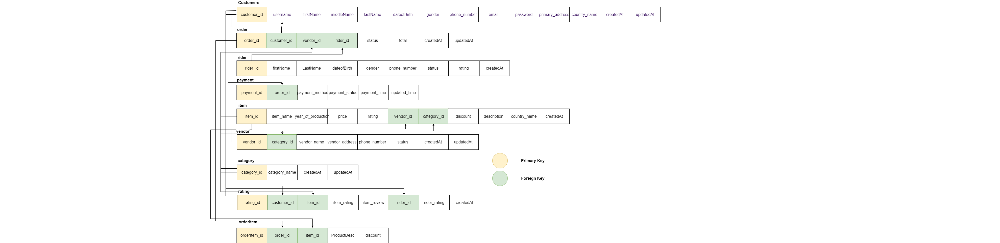

# `E-Platform for Musical Instrument`

# Data Modeling and Management 

# Instructor : Dr. Chutiporn Anutariya

## Contributor:
* Mr. Ayush Koirala
* Mr. Tonson Praphabkul
* Mr. Sorn Rambo
* Mr. Nirut Gammayeengoen
* Ms. Sirikit Joshi

## Technologies Used
* My SQL

## Project Description :

* Musicians are eager to buy musical instrument and want to know their features before making the purchase. 
* Although, traditionally musicians try the instrument before buying, nowadays the consistency in quality means that the product is exactly as listed. 
* Buyers can watch online reviews before deciding to make a purchase.

## Need of project:
* To help people who want to know about the musical Instruments and its features.
* To help the people who want to purchase musical instruments.
* To help buyers make an informed decision.
* To connect the vendor and the buyer and facilitate safe business transaction.

## Conceptual digram :

## Data Operations:
* <strong>INSERT:</strong> New Customer, New Category, New Vendor, New Item, New Order, New OrderItem, New Rider, New Payment
* <strong>Update:</strong> Customer Information, Customer Password,Vendor Information, Item Description, Item Review, Order Total, Rider rating, Delivery Information, Payment
* <strong>DELETE </strong>Customer,Vendor, Item, Order, Rating 

## Logical diagram:

## Queries & Reports:
* <strong>Orders:</strong>Sales sorted by year, Ranking of busiest month of 2021, List of orders in past month, List of paid, orders currently in progress, List of orders based on quantity, Orders sorted by status, No. of Orders delivered in last 30 days, Total revenue generated via platform
* <strong>Payment:</strong>Payment method and status summary, Transaction via Cash on Delivery, Transaction via E-payment, List of customers who pay by COD, List of customers who pay by E-payment, List of customers who completed payments, List of customers with pending payments, Latest payment by COD, Latest payment by E-payment
* <strong>Rating:</strong>Average rating, Total number of ratings given by customers, Vendors and Items with bad rating, Vendors and Items with good rating, Count of customers who have rated or not
* <strong>OrderItem: </strong> Top 5 orders with highest occurrence, Search for specific order, the containing items and their quantities

## For more details visit : `https://github.com/ayushkoirala/E-PLATFORM-FOR-MUSICAL--INSTRUMENT/blob/main/MYSQL/PRESENTATION%20SLIDES%20-%20E-Platform%20for%20Musical%20Instrument.pdf`

